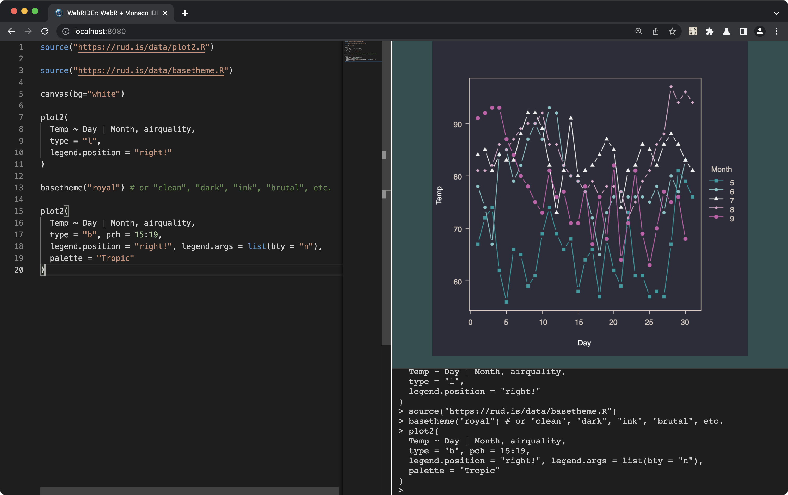

# 🧪 🕸️ WebRIDEr: Monaco-powered WebR "REPL" & IDE

This is a fairly accessible project so I'm not going to complicate it with "Vite" or "Lit" bits.

I wouldn't pay for this, but it's a pretty decent IDE for WebR, given WebR itself is at 0.1.1.

## Left Source Pane

- Auto-saves current source pane contents to local storage
- R syntax highlighting
- An oddly decent # of auto-completes
- cmd-shift-p to bring up command palette
    - **WebR: Clear Local Storage** — nuke local storage and replace with the default document
    - **WebR: Save Canvas as PNG** — captain obvious
    - **WebR: Save Source Pane** — captain obvious
    - **WebR: View WebR Environment Summary** — captain obvious
    - **WebR: View WebR History** — captain obvious
- cmd-shift-i inserts `|>`
- option-shift-minus inserts `<-`
- watches for `?…` and will open up a new tab for web help on whatev u searched for (XSS protected)
- watches for `broweURL(…)` and will open up the URL in a new tab (XSS protected)
- baked-in `install.runiverse(pkg)` which will try to install a pkg from R Universe. It is ON YOU to load the deps and ensure all deps and the `pkg` itself will work in WebR. You can [use this tool I made](https://observablehq.com/@hrbrmstr/fiddling-with-r-universe-webr) to help you out.
- 

## Top Right Plot Pane

- janky-ish {webr} `canvas()` displayer

## Bottom Right Console

- non-editable & non-interactive output place for what is sent to the R console, including `stdout` and `stderr`

See it live! <https://rud.is/w/webr-monaco-repl/>

